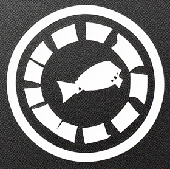
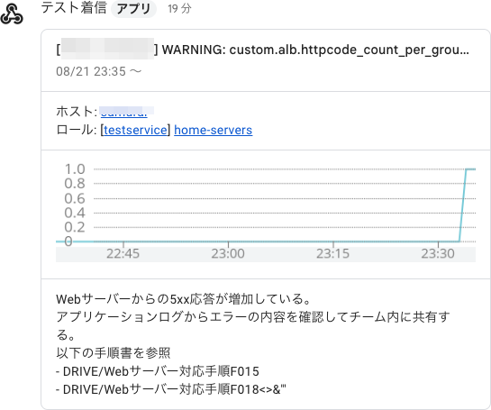

# Mackerel Webhook Gateway



Copyright 2023 Kenshi Muto

監視サービス[Mackerel](https://ja.mackerel.io)のWebhookを受け取り、ほかの形式のWebhookに引き渡すゲートウェイのライブラリです。

以下のMackerelのWebhook通知に対応します。

- サンプル（Mackerelの「テスト」で送出されるもの）
- アラート通知
- アラートグループ通知
- ホストステータス変更
- ホスト登録
- ホスト退役
- 監視ルールの操作（追加・変更・削除）

## Google Chatでの実行

実装のリファレンスとして、Google Chat Webhook変換を用意しています。各通知をGoogle Chatに送信できます（ただし、現時点でGoogle ChatのWebhookは有償プランのみでしか使えません）。



### Sinatraを使う場合

以下のようにGoogle ChatスペースのWebhook URLを指定した`.env`ファイルを用意し、本Gitリポジトリを展開しているフォルダに配置します。

```
GOOGLECHAT_WEBHOOK=https://chat.googleapis.com/v1/spaces/…
```

Sinatra gemをインストールします。

```
$ gem install sinatra
```

Sinatraのサーバーを起動します。

```
$ exe/webhook-handler-googlechat.rb
```

デフォルトでは全IPアドレスにバインドした状態でTCPポート4567、パス`/`で待ち受けます。変更したいときには`.env`ファイルで`SERVER_BIND`・`SERVER_PORT`・`SERVER_PATH`を指定してください。

用意したこのサーバーに対してMackerelから送信するようチャンネルを設定します。インターネット経由でアクセスできる必要があるため、ngrokやWebサーバーのプロキシを使ってアクセスできるようにしておきましょう。

Mackerelの通知チャンネルの追加で「Webhook」を選び、URLにインターネット経由でアクセスされるURLを指定します。作成されたWebhookチャンネルで「テスト」をクリックすると、サンプルの通知がGoogle Chatに飛びます。

### AWS Lambdaでの実行

AWS LambdaのRubyランタイムと関数URLを使ってサーバーレスで実行することもできます。

まず、アップロードするmackerel-webhook-gateway-googlechat.zipファイルを作成します。

```
$ ./make-lambda-zip.sh
```

この作成シェルスクリプトはDebian bookworm用に作っており、Ruby 3.1で用意されるフォルダ名をLambdaのRuby 3.2用に変更しています。ほかのOSやバージョンの場合は適宜変更してください。

AWSでLambdaを用意します。

- 一から作成
- 関数名: 任意
- ランタイム: 「Ruby 3.2」
- アーキテクチャ: 任意
- デフォルトの実行ロールの変更: 環境に応じて
- 詳細設定の 関数URLを有効化: チェック
- 認証タイプ: NONE（※パブリックなエンドポイントになることに注意）
- 呼び出しモード: BUFFERED（デフォルト）
- オリジン間リソース共有（CORS）を設定: 任意

「コード」タブの「コードソース」の「アップロード元」からmackerel-webhook-gateway-googlechat.zipファイルをアップロードします。

下にスクロールして「ランタイム設定」に進み、「編集」をクリックしてハンドラを以下のとおり変更します。

```
exe/lambda-handler-googlechat.lambda_handler
```

次に「コード」に戻り、「設定」タブをクリックして、「環境変数」を選びます。「環境変数の追加」をクリックし、キーに `GOOGLECHAT_WEBHOOK` 、値にGoogle ChatスペースのWebhook URLを指定します。

さらに「暗号化の設定」を選び、「転送時の暗号化に使用するヘルパーの有効化」にチェックします。値の右に「転送時の暗号化」というボタンができるので、これをクリックし、KMSキーを選びます。

「実行ロールポリシー」に復号のためにLambdaの実行IAMロールに追加する必要のあるポリシーが示されるので、これをIAMロールに付加してください。

「関数の概要」にWebhookエンドポイントとなる「関数URL」が表示されているので、Mackerelの通知チャンネルの追加で「Webhook」を選び、URLにその関数URLを指定します。作成されたWebhookチャンネルで「テスト」をクリックすると、サンプルの通知がGoogle Chatに飛びます。

### カスタマイズ

メッセージを変更したいときには、`lib/mackerel-webhook-gateway/googlechat.rb`を直接書き換える方法もありますが、一部だけであれば`customize.rb`でメソッドをオーバーライドするのが簡単です。

```
# Mackerel Webhook Gateway Override
module GoogleChatOverride
  # MackerelWebhookGateway::GoogleChat の一部のメソッドの挙動(カード出力など)を変えたいときにはここでメソッドを上書きする
  # sampleメソッドを上書きする例
  def sample(h)
    header = { title: '通知のテスト' }
    widget1 = [{ textParagraph: { text: h[:message] } }]
    sections = [{ widgets: widget1 }]
    googlechat_card(header, sections)
  end
end

module MackerelWebhookGateway
  class GoogleChat
    prepend GoogleChatOverride
  end
end
```

## MackerelのWebhook JSONスキーマについて

webhooksフォルダに、参考としてMackerelのWebhook JSONのスキーマファイルを入れています。

内部仕様ではなく、出力から導出したものなので、正確性の保証はないことに注意してください。また、スキーマ内部で本来分岐が必要なもの（監視ルールの設定など）についても対応はしていません。

## ライセンス
```
MIT License

Copyright (c) 2023 Kenshi Muto

Permission is hereby granted, free of charge, to any person obtaining a copy
of this software and associated documentation files (the "Software"), to deal
in the Software without restriction, including without limitation the rights
to use, copy, modify, merge, publish, distribute, sublicense, and/or sell
copies of the Software, and to permit persons to whom the Software is
furnished to do so, subject to the following conditions:

The above copyright notice and this permission notice shall be included in all
copies or substantial portions of the Software.

THE SOFTWARE IS PROVIDED "AS IS", WITHOUT WARRANTY OF ANY KIND, EXPRESS OR
IMPLIED, INCLUDING BUT NOT LIMITED TO THE WARRANTIES OF MERCHANTABILITY,
FITNESS FOR A PARTICULAR PURPOSE AND NONINFRINGEMENT. IN NO EVENT SHALL THE
AUTHORS OR COPYRIGHT HOLDERS BE LIABLE FOR ANY CLAIM, DAMAGES OR OTHER
LIABILITY, WHETHER IN AN ACTION OF CONTRACT, TORT OR OTHERWISE, ARISING FROM,
OUT OF OR IN CONNECTION WITH THE SOFTWARE OR THE USE OR OTHER DEALINGS IN THE
SOFTWARE.
```
